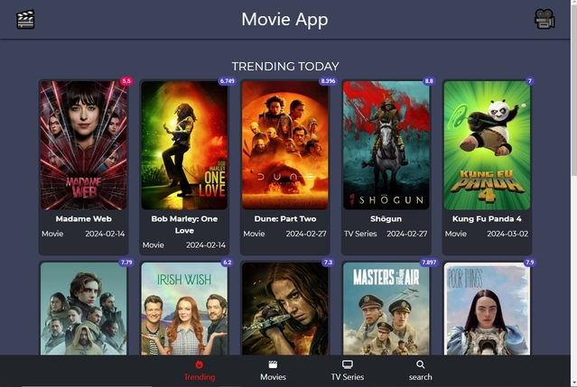
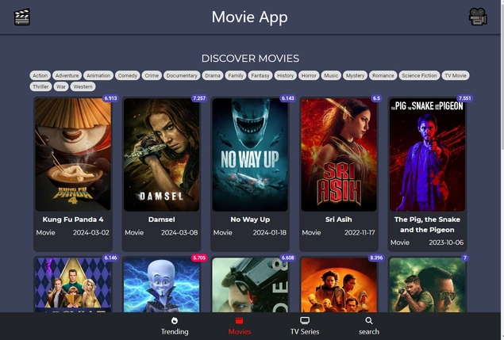
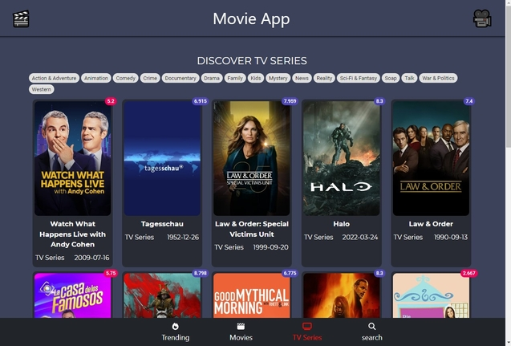
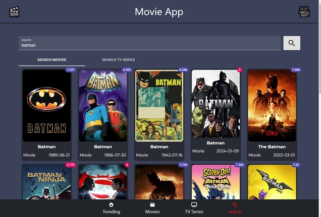
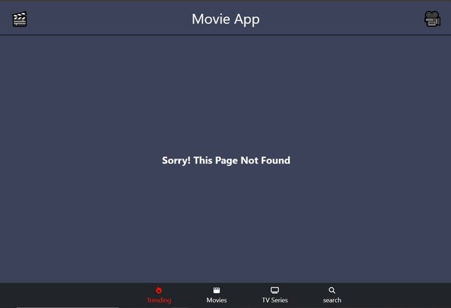

# Movie App

## This Project Live Domain [Movie-App](https://bola-nabil.github.io/Movie-App/)

### Get info for all your favorite movies and series

## Skills used in the project
- HTML & HTML5
- CSS & CSS3
- Bootstrap
- Material-ul
- Responsive Design
- React
- React Router
- React Hooks
- API

You can start Project
```
npm start
```
Runs the app in the development mode.\
Open [http://localhost:3000](http://localhost:3000) to view it in your browser.

### Trending Page


### Movies Page


### TV Series Page


### Search Page


### Not Found Page

